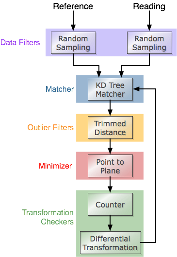

| [Tutorials Home](index.md)    | [Previous](ICPIntro.md) | [Next](Configuration.md) |
| ------------- |:-------------:| -----:|

# Default Configuration of the ICP Chain

The following details the default configuration for ICP in libpointmatcher.

|Figure 1: Default ICP chain configuration|
|:------|
||

## Data Filters
Both the reference and reading clouds are processed with [random sampling](Datafilters.md#randomsamplinghead) filters.  These will sample each data point with a probability of 0.75 thus yielding smaller point clouds.

## Matcher
The default matcher is the KD tree matcher.  Each point is matched to its closest neighbor in the reference cloud.  A KD tree with a linear heap is used.

## Outlier Filters
One trimmed distance outlier filter is used.  The filter ranks the points in the reading cloud by their distance to the reference after a transformation was applied.  The top 85% points (those with the smallest distances) are kept.

## Minimizer
The point-to-plane variant is used in the minimization step.  Point-to-plane allows for points to "slide" along planes and generally performs better than the point-to-point variant.

## Transformation Checkers
The counter checker automatically stops the ICP loop after a maximum of 40 iterations.  The differential transformation checker stops the ICP loop when the relative transformation motions between iterations is below a threshold.  In other words, when each subsequent iteration produces little change in the transformation, then the algorithm is stopped.  Because the relative motions are generally prone to jagged oscillations, smoothing is applied by taking the average the relative differences over several iterations.

## Inspectors
No inspector is applied.
